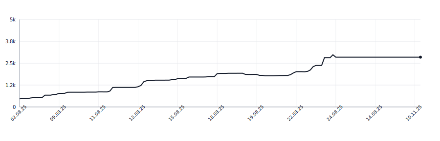

# i19n-backend

## Lines of code

<picture>
  <source
    media="(prefers-color-scheme: dark)"
    srcset=".github/loc-history-dark.svg"
  >
  <source
    media="(prefers-color-scheme: light)"
    srcset=".github/loc-history-light.svg"
  >
  
</picture>

Updated daily. Made with [LOC Graph Action](https://github.com/botforge-pro/loc-graph-action)
